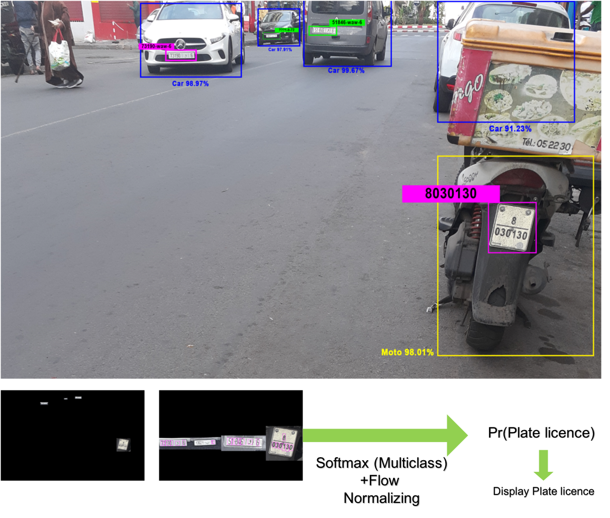
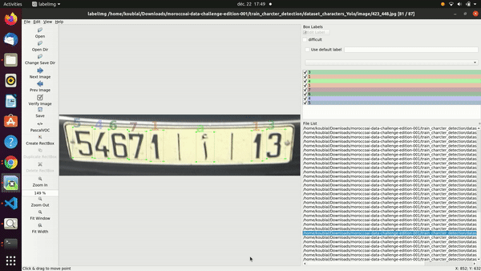
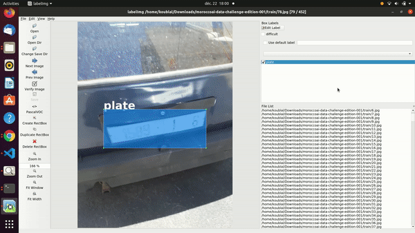
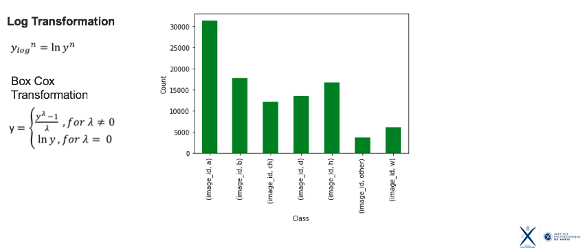
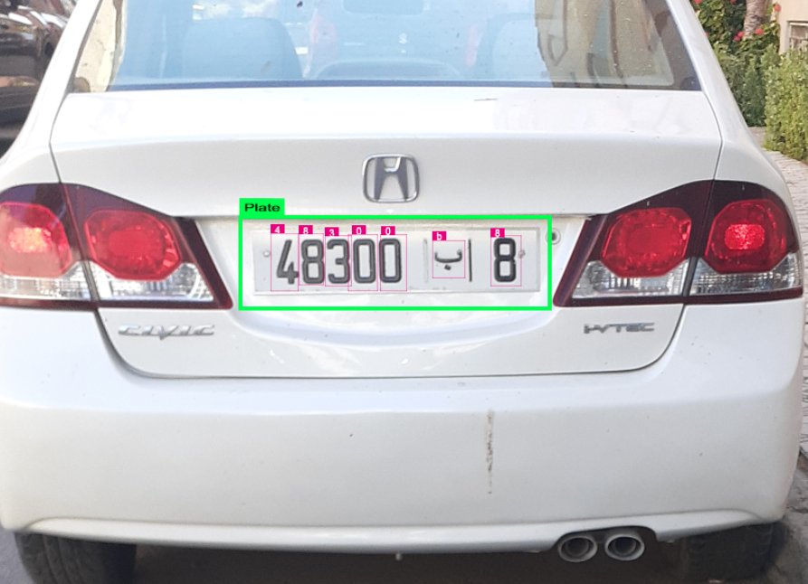

# This paper won the Nvidia - ANRT - MoroccoAI  (conference of December 2021) 
### ✨ MoroccoAI-Data-Challenge ✨

[Read our paper: An advanced combination of semi-supervised Normalizing Flow & Yolo (YoloNF)](https://arxiv.org/abs/2207.10777)

## Abstract
  This project provides a solution to Morocco-AI challenge (conference of december), which aims to detect the plate with the label name as type of ```XXXX-ﺏ-YY``` , our project Pipeline detect only 19 classes ```0,1,2,3,4,5,6,7,8,9 and ww ,ا, ب ,ج ,ش, و ,المغرب ,ه ,د``` . After the network it self take the bounding box and try to recognize the text inside the bounding box. To get the text correctly our strategy is to use two neural networks with deep flow normalizing block to detect each character. If the character has a projection far scale a normal distribution (the network is trained on semi-supervise strategy) the Yolo proceeds to propose a new bounding box the final decision presents a strong confidence. The detection and recognition result lead us among the top 10% of this challenge.



# An advanced combination of semi-supervised Normalizing Flow & Yolo (YoloNF) to detect and recognize vehicle license plates  ✨

  - [Plate Recognition Using YOLO and CNN](#plate-recognition-using-yolo-and-cnn)
  - [Intorduction](#intorduction)
  - [Process Create This Project](#process-create-this-project)
  - [How to run this program](#how-to-run-this-program)
  - [Preview This Project](#preview-this-project)
  - [Conclustion my own Flow Normalizing model vs easyocr](#conclustion-my-own-cnn-model-vs-easyocr)


## First Step 

1. **Annotation of Moroccan Plates Licenses**
   This data-challenge addresses the problem of ANPR in Morocco licensed vehicles. Based on a small training dataset of more labeled car images, the model should have accurate recognize the plate numbers of Morocco licensed vehicles.
   We have created an annotated database [annotated database](https://drive.google.com/drive/folders/1ZFdMo-CyisVzXsSioRH9KrbbD1J4_BMH?usp=sharing) for this challenge that we make available to other editions, or other activities related to number recognition and Arabic characters. 
   You can label your dataset image using [Labelimg]() or [makesense.ai]( and choose the YOLO format or the file with extenstion *.txt




2. **Create YOLO model for object detection**
   in these project i use YOLOv3  to make object deteaction model. You can learn more about the yolo in the documentation [link here](https://github.com/ultralytics/yolov5)

   > YOLO an acronym for 'You only look once', is an object detection algorithm that divides images into a grid system. Each cell in the grid is responsible for detecting objects within itself.

   if you want to create your own object detection with custom dataset you can watch these helpful tutorial to achieve that in [here](https://www.youtube.com/watch?v=GRtgLlwxpc4)

3. **Data Augementation and Transformation**
  
  This is an unbalanced case of the classes, what it does is perform a log(y) transformation on the data just before the CNN input.


**Please note that our free dataset is available here: [https://www.malpr.ml/](https://www.malpr.ml/)

4. **Downoald Weights and config files**
  All pretrained weights are saved on:  [Weights and config](https://drive.google.com/drive/folders/1qTvKYEfpLR-4hcFaeT11aB_bpCX3lQUi?usp=sharing)


5. **Downoald dataset**
  a new database has been created and labelled with Yolo format.
  (Part 1)- [annotated database](https://drive.google.com/drive/folders/1ZFdMo-CyisVzXsSioRH9KrbbD1J4_BMH?usp=sharing)
  (Part 2)- [annotated database](https://drive.google.com/drive/folders/1ZFdMo-CyisVzXsSioRH9KrbbD1J4_BMH?usp=sharing)
  (Part 3)- [annotated database](https://drive.google.com/drive/folders/1ZFdMo-CyisVzXsSioRH9KrbbD1J4_BMH?usp=sharing)

## How to run this program

1.  You must have python 3 install in your computer if you haven't python you can download and install your python from [here](https://www.python.org/downloads/)
2.  Clone these github repo with these command
  ```git
  git clone https://github.com/ragilhadi/plate-recognition-yolo-cnn
  ```
3. Run this command to install all the python packages
```python
cd plate-recognition-yolo-cnn
pip install -r requirements.txt #for windows
pip3 install -r requirements.txt #for mac or linux
```
> Note: You must have all the python package to run the project

4. **Notebook cas <<Detect_Morocco_Plates_YoloFN_Detect_Recognition.ipynb>>:** if you want to check the plate number:

For live **video input** and use **CNN** type this command
```python
license = predict('../' + saved_image, output_car_path = '../output_cnn.jpg', output_license_path_original = '../license_original_cnn.jpg', output_license_path = '../license_cnn.jpg', is_cnn=True, is_image=True)
is_image=True # it's not stream video 
is_image=False # stream video with FPS=2
is_cnn=True # Combine CNN Flow normalizing and Yolov3 
```
5. **How can I submit all the plates detection and recognition on dataset as a csv file?**

```python
import glob
from os import walk
import pandas as pd
test_path='/home/oublal/challengeMoroccoAI/test/'
data=pd.DataFrame()
#data["id_image"]=test["id_image"]
data["id_image"]=0
data["id_string"]=0
for (dirpath, dirnames, filenames) in walk(test_path):
    data["img_name"]=filenames
for (dirpath, dirnames, filenames) in walk(test_path):
    data["path"]=dirpath
   # break
data["id_string"]=data.apply(lambda x: predict_all(x.img_name, x.path,
                                                 video_path=None, is_cnn=False,is_image=True), axis=1)
submussion=data.drop(colomns=['img_name','path'])
submussion.to_csv('submission.csv',index=False)
```
6. show an image:

```python
license = predict('../' + saved_image, output_car_path = '../output_cnn.jpg', output_license_path_original = '../license_original_cnn.jpg', output_license_path = '../license_cnn.jpg', is_cnn=True, is_image=True)
```
Example 570.jpg from dataset -> output :




7. **.py file /code/..:** if you want to check the plate number:

You must first define some parameters like path_input, path_output, test_data (proposed for this challenge). and then run the 3 files in order ( preprocessig, training yolo, training yolo characters, then detection and recognition) 

## Cite our work
```
@article{oublal2022advanced,
  title={An advanced combination of semi-supervised Normalizing Flow \& Yolo (YoloNF) to detect and recognize vehicle license plates},
  author={Oublal, Khalid and Dai, Xinyi},
  journal={arXiv preprint arXiv:2207.10777},
  year={2022}
}
```
